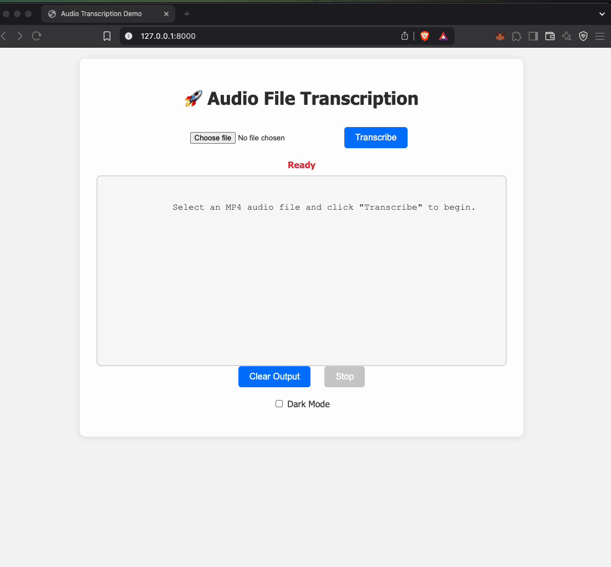

# Transcriber

### Using Ollama and Whisper running locally with [PyTorch](http://pytorch.org/)

Transcriber is a project designed to transcribe audio files into text using a Python backend.
Transcription and LLM-based optimization of the transcription are performed locally using Ollama.
The project makes extensive use of coroutines, and transcription tasks can be cancelled at any time.

## Features

- Audio file upload and real-time transcription streaming
- GPU acceleration
- All models run locally

## Demo



## Getting Started

### Backend

1. Navigate to the `backend` directory:
   ```sh
   cd backend
   ```
2. (Optional) Create and activate a virtual environment:
   ```sh
   python3 -m venv venv
   source venv/bin/activate
   ```
3. Install dependencies:
   ```sh
   uv pip install .
   ```
4. Start the backend server:
   ```sh
   ./start.sh
   ```

### Frontend

- Open `app.index.html` in your browser, or deploy using the provided Dockerfile at `infra/Dockerfile.frontend`.

### Running Tests

From the `backend` directory, run:

```sh
./run_tests.sh
```

## License

MIT License

## Author

Boris
